<h1>Projet Final: Spring Angular - Digital Banking</h1>
<h2>parties backend</h2>

1-les entités JPA : Customer, BankAccount, Saving Account, CurrentAccount, AccountOperation

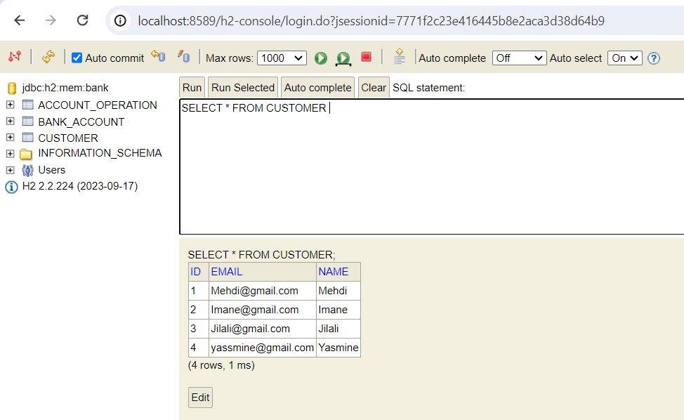

 RestController avec postMan 

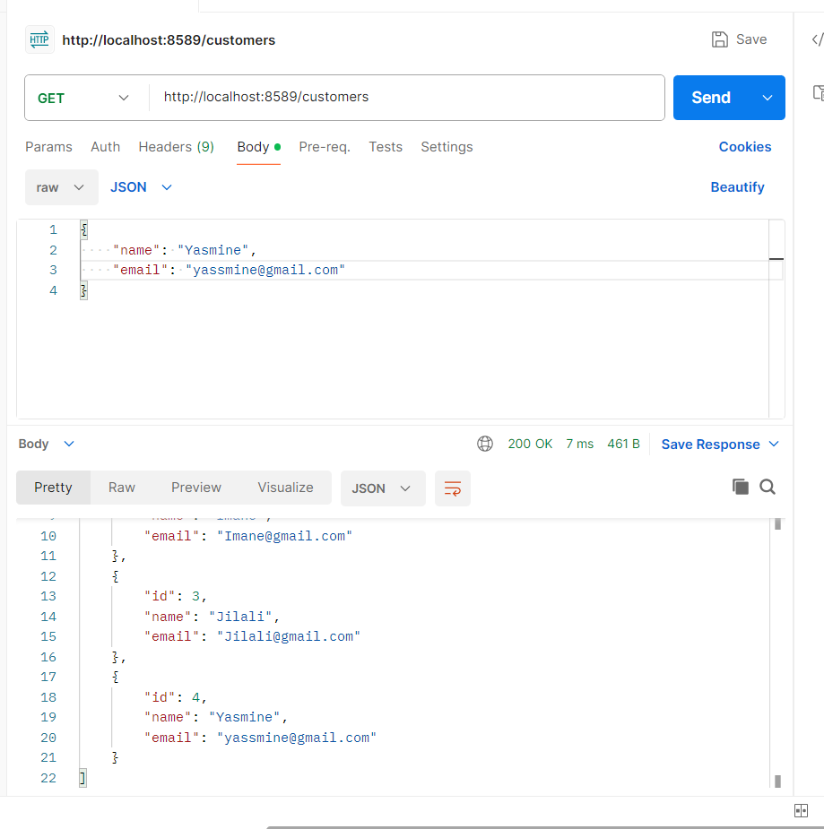
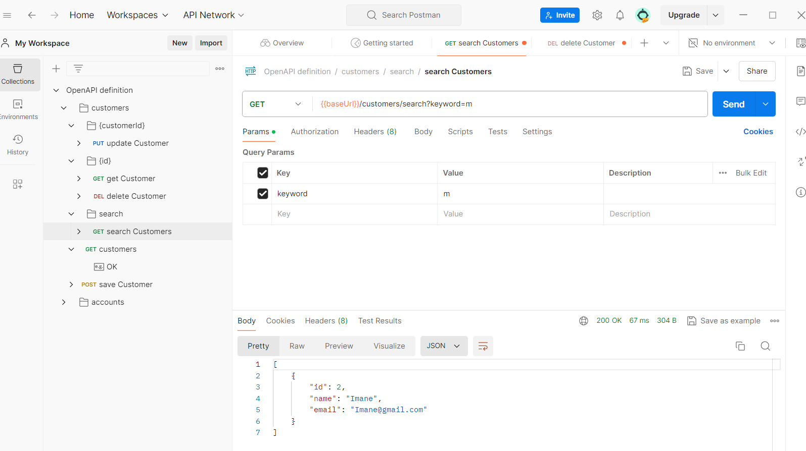

 Swager-ui 

 <p1>customer-rest-controller</p1>
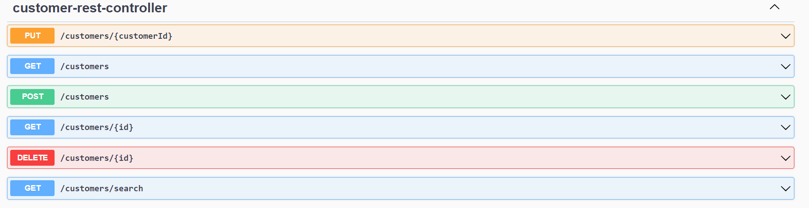
<p1>bank-account-rest-api</p1>
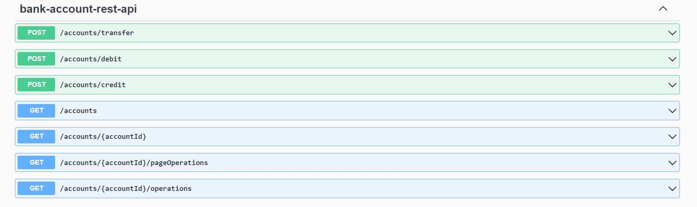
<h2>parties Web</h2>
<p1>afficher la listes des clients</p1>
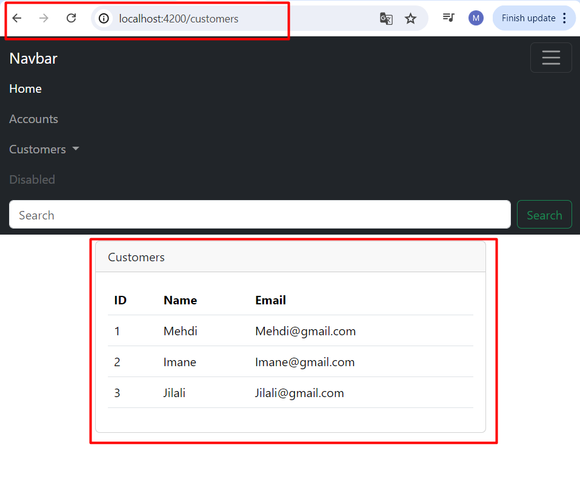
<p1>err</p1>
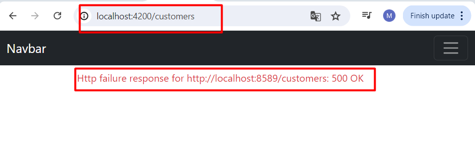
<p1>ajouter un client</p1>
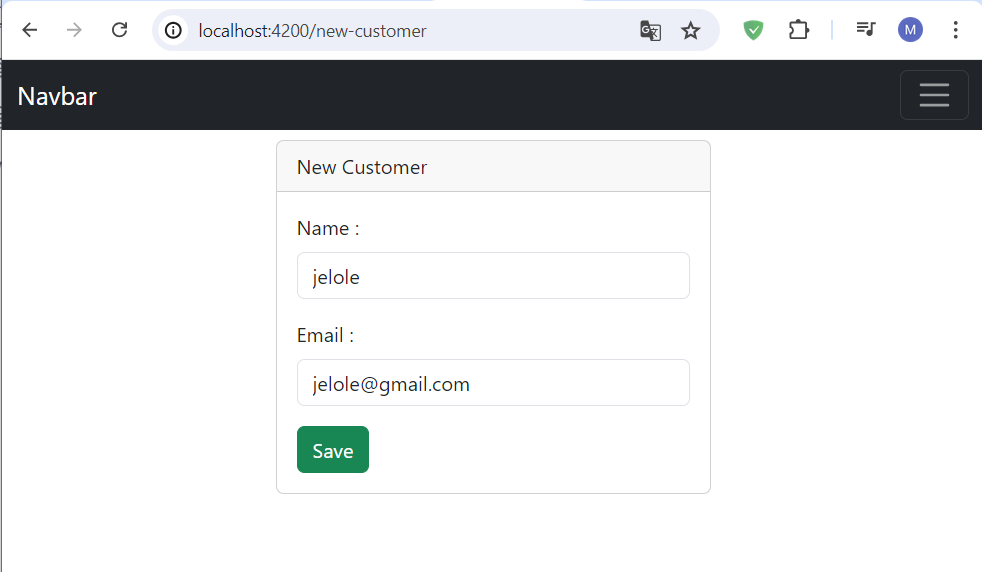
<p1>save dans la DB</p1>
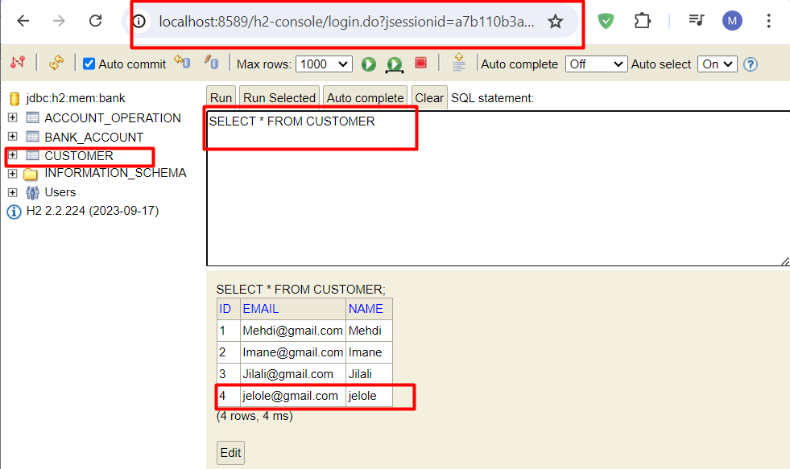
<p1>suprimer un client</p1>
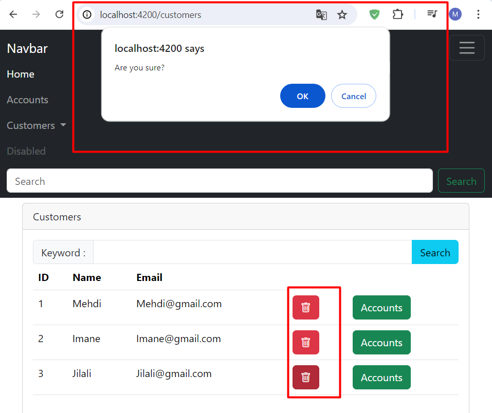
<p1>la liste des operations </p1>
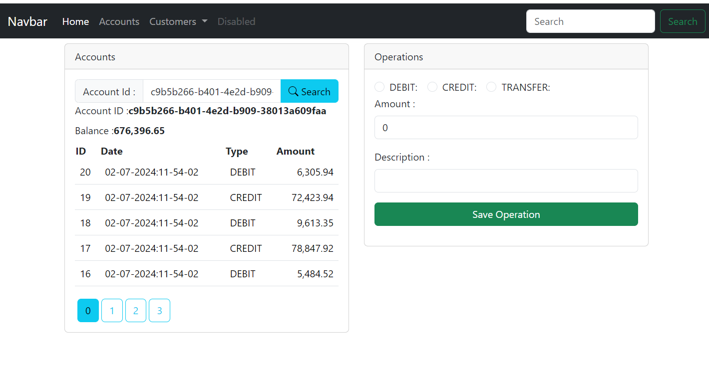
